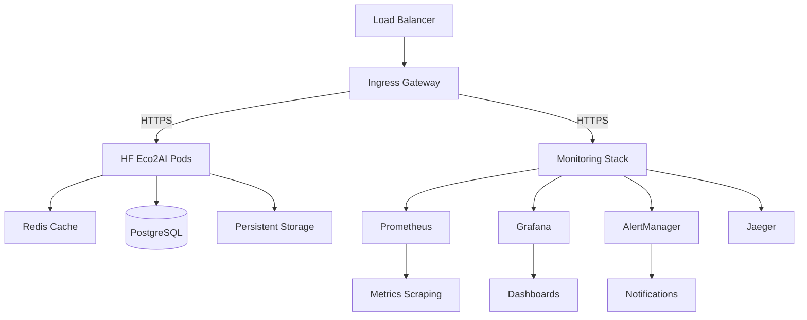

# Enterprise Deployment Guide

## HF Eco2AI Plugin - Production Deployment

This comprehensive guide covers enterprise-grade deployment of the HF Eco2AI Plugin across multiple environments with full monitoring, security, and operational excellence.

## Table of Contents

1. [Prerequisites](#prerequisites)
2. [Architecture Overview](#architecture-overview)
3. [Environment Setup](#environment-setup)
4. [Security Configuration](#security-configuration)
5. [Deployment Methods](#deployment-methods)
6. [Monitoring & Observability](#monitoring--observability)
7. [Scaling & Performance](#scaling--performance)
8. [Disaster Recovery](#disaster-recovery)
9. [Troubleshooting](#troubleshooting)

## Prerequisites

### Infrastructure Requirements

#### Minimum Requirements
- **Kubernetes Cluster**: v1.26+
- **Nodes**: 3+ nodes with 4 CPU cores, 8GB RAM each
- **Storage**: 100GB persistent storage per environment
- **Network**: Load balancer support, ingress controller

#### Recommended Requirements
- **Kubernetes Cluster**: v1.28+ with HA control plane
- **Nodes**: 5+ nodes with 8 CPU cores, 16GB RAM each
- **Storage**: SSD-backed storage with 500GB+ capacity
- **Network**: Dedicated ingress with SSL termination

### Software Dependencies

```bash
# Core tools
kubectl v1.28+
helm v3.14+
docker v24.0+

# Optional tools
terraform v1.6+
ansible v2.15+
prometheus-operator
grafana-operator
```

### Access Requirements

- Kubernetes cluster admin access
- Container registry access (GHCR, Docker Hub, or private registry)
- DNS management for ingress
- SSL certificate management
- Monitoring infrastructure access

## Architecture Overview

### High-Level Architecture



### Component Responsibilities

| Component | Purpose | Scaling |
|-----------|---------|---------|
| HF Eco2AI Pods | Core application logic | Horizontal (3-10 replicas) |
| Redis | Caching & session storage | Master-Replica setup |
| PostgreSQL | Persistent data storage | HA with read replicas |
| Prometheus | Metrics collection | Federated setup |
| Grafana | Visualization & alerting | HA deployment |
| Jaeger | Distributed tracing | Scalable collectors |

## Environment Setup

### Development Environment

```yaml
# values-development.yaml
global:
  environment: development
  
replicaCount: 1

resources:
  requests:
    cpu: 100m
    memory: 256Mi
  limits:
    cpu: 500m
    memory: 512Mi

monitoring:
  enabled: true
  retention: 7d

redis:
  enabled: true
  replica:
    replicaCount: 1

postgresql:
  enabled: true
  primary:
    persistence:
      size: 5Gi
```

### Staging Environment

```yaml
# values-staging.yaml
global:
  environment: staging
  
replicaCount: 2

resources:
  requests:
    cpu: 250m
    memory: 512Mi
  limits:
    cpu: 1
    memory: 2Gi

monitoring:
  enabled: true
  retention: 30d

autoscaling:
  enabled: true
  minReplicas: 2
  maxReplicas: 5

redis:
  enabled: true
  replica:
    replicaCount: 2

postgresql:
  enabled: true
  primary:
    persistence:
      size: 20Gi
```

### Production Environment

```yaml
# values-production.yaml
global:
  environment: production
  
replicaCount: 3

resources:
  requests:
    cpu: 500m
    memory: 1Gi
  limits:
    cpu: 2
    memory: 4Gi

monitoring:
  enabled: true
  retention: 90d

autoscaling:
  enabled: true
  minReplicas: 3
  maxReplicas: 10

redis:
  enabled: true
  replica:
    replicaCount: 3

postgresql:
  enabled: true
  primary:
    persistence:
      size: 100Gi
  readReplicas:
    replicaCount: 2

backup:
  enabled: true
  schedule: "0 2 * * *"
  retention: 30

networkPolicy:
  enabled: true

podSecurityPolicy:
  enabled: true
```

## Security Configuration

### Network Security

#### Network Policies

```yaml
# Network isolation
apiVersion: networking.k8s.io/v1
kind: NetworkPolicy
metadata:
  name: hf-eco2ai-network-policy
spec:
  podSelector:
    matchLabels:
      app.kubernetes.io/name: hf-eco2ai
  policyTypes:
    - Ingress
    - Egress
  ingress:
    - from:
        - namespaceSelector:
            matchLabels:
              name: ingress-nginx
      ports:
        - protocol: TCP
          port: 8000
  egress:
    - to:
        - namespaceSelector:
            matchLabels:
              name: monitoring
      ports:
        - protocol: TCP
          port: 9090
```

#### TLS Configuration

```yaml
# TLS certificate management
apiVersion: cert-manager.io/v1
kind: Certificate
metadata:
  name: hf-eco2ai-tls
spec:
  secretName: hf-eco2ai-tls
  issuerRef:
    name: letsencrypt-prod
    kind: ClusterIssuer
  dnsNames:
    - hf-eco2ai.company.com
    - api.hf-eco2ai.company.com
```

### Pod Security

#### Security Context

```yaml
securityContext:
  runAsNonRoot: true
  runAsUser: 1001
  runAsGroup: 1001
  fsGroup: 1001
  seccompProfile:
    type: RuntimeDefault
  capabilities:
    drop:
      - ALL
    add:
      - NET_BIND_SERVICE
```

#### Pod Security Standards

```yaml
apiVersion: v1
kind: Namespace
metadata:
  name: hf-eco2ai-production
  labels:
    pod-security.kubernetes.io/enforce: restricted
    pod-security.kubernetes.io/audit: restricted
    pod-security.kubernetes.io/warn: restricted
```

### RBAC Configuration

```yaml
apiVersion: rbac.authorization.k8s.io/v1
kind: Role
metadata:
  name: hf-eco2ai-role
rules:
  - apiGroups: [""]
    resources: ["pods", "services", "configmaps"]
    verbs: ["get", "list", "watch"]
  - apiGroups: ["apps"]
    resources: ["deployments"]
    verbs: ["get", "list", "watch"]

---
apiVersion: rbac.authorization.k8s.io/v1
kind: RoleBinding
metadata:
  name: hf-eco2ai-rolebinding
subjects:
  - kind: ServiceAccount
    name: hf-eco2ai
roleRef:
  kind: Role
  name: hf-eco2ai-role
  apiGroup: rbac.authorization.k8s.io
```

## Deployment Methods

### Method 1: Helm Deployment (Recommended)

#### Install Helm Chart

```bash
# Add Helm repository
helm repo add hf-eco2ai https://charts.terragonlabs.com
helm repo update

# Create namespace
kubectl create namespace hf-eco2ai-production

# Install with production values
helm install hf-eco2ai hf-eco2ai/hf-eco2ai \
  --namespace hf-eco2ai-production \
  --values values-production.yaml \
  --wait \
  --timeout=10m
```

#### Upgrade Deployment

```bash
# Upgrade to new version
helm upgrade hf-eco2ai hf-eco2ai/hf-eco2ai \
  --namespace hf-eco2ai-production \
  --values values-production.yaml \
  --version 1.0.1 \
  --wait \
  --timeout=10m

# Rollback if needed
helm rollback hf-eco2ai --namespace hf-eco2ai-production
```

### Method 2: Kubernetes Manifests

#### Apply Manifests

```bash
# Apply in order
kubectl apply -f deployment/kubernetes/namespace.yaml
kubectl apply -f deployment/kubernetes/configmap.yaml
kubectl apply -f deployment/kubernetes/pvc.yaml
kubectl apply -f deployment/kubernetes/deployment.yaml
kubectl apply -f deployment/kubernetes/service.yaml
kubectl apply -f deployment/kubernetes/ingress.yaml
kubectl apply -f deployment/kubernetes/hpa.yaml
```

### Method 3: Terraform + Helm

#### Terraform Configuration

```hcl
# terraform/main.tf
module "hf_eco2ai" {
  source = "./modules/hf-eco2ai"
  
  namespace        = "hf-eco2ai-production"
  chart_version    = "1.0.0"
  values_file      = "values-production.yaml"
  
  monitoring_enabled = true
  backup_enabled     = true
  
  tags = {
    Environment = "production"
    Team        = "ml-platform"
    Cost-Center = "engineering"
  }
}
```

### Method 4: GitOps with ArgoCD

#### ArgoCD Application

```yaml
apiVersion: argoproj.io/v1alpha1
kind: Application
metadata:
  name: hf-eco2ai-production
  namespace: argocd
spec:
  project: default
  source:
    repoURL: https://github.com/terragonlabs/hf-eco2ai-plugin
    targetRevision: v1.0.0
    path: deployment/helm/hf-eco2ai
    helm:
      valueFiles:
        - values-production.yaml
  destination:
    server: https://kubernetes.default.svc
    namespace: hf-eco2ai-production
  syncPolicy:
    automated:
      prune: true
      selfHeal: true
    syncOptions:
      - CreateNamespace=true
```

## Monitoring & Observability

### Metrics Collection

#### Prometheus Configuration

```yaml
# prometheus-config.yaml
global:
  scrape_interval: 15s
  evaluation_interval: 15s

rule_files:
  - "/etc/prometheus/rules/*.yml"

scrape_configs:
  - job_name: 'hf-eco2ai'
    kubernetes_sd_configs:
      - role: endpoints
        namespaces:
          names:
            - hf-eco2ai-production
    relabel_configs:
      - source_labels: [__meta_kubernetes_service_annotation_prometheus_io_scrape]
        action: keep
        regex: true
```

#### Key Metrics

| Metric | Description | Alert Threshold |
|--------|-------------|-----------------|
| `hf_eco2ai_carbon_emissions_total` | Total carbon emissions | > 1000 g CO2/hour |
| `hf_eco2ai_requests_total` | Total requests | Rate > 1000/min |
| `hf_eco2ai_request_duration_seconds` | Request latency | P95 > 5s |
| `hf_eco2ai_memory_usage_bytes` | Memory usage | > 80% of limit |
| `hf_eco2ai_cpu_usage_percent` | CPU usage | > 80% of limit |

### Alerting Rules

```yaml
# alerts.yml
groups:
  - name: hf-eco2ai-alerts
    rules:
      - alert: HighCarbonEmissions
        expr: rate(hf_eco2ai_carbon_emissions_total[5m]) > 1000
        for: 5m
        labels:
          severity: warning
          team: ml-platform
        annotations:
          summary: "High carbon emissions detected"
          description: "Carbon emissions rate is {{ $value }} g CO2/hour"
          runbook_url: "https://runbooks.company.com/hf-eco2ai/high-carbon-emissions"

      - alert: HighLatency
        expr: histogram_quantile(0.95, rate(hf_eco2ai_request_duration_seconds_bucket[5m])) > 5
        for: 2m
        labels:
          severity: warning
          team: ml-platform
        annotations:
          summary: "High request latency"
          description: "95th percentile latency is {{ $value }}s"

      - alert: ServiceDown
        expr: up{job="hf-eco2ai"} == 0
        for: 1m
        labels:
          severity: critical
          team: ml-platform
        annotations:
          summary: "HF Eco2AI service is down"
          description: "HF Eco2AI service has been down for more than 1 minute"
```

### Grafana Dashboards

#### Application Dashboard

```json
{
  "dashboard": {
    "title": "HF Eco2AI - Application Metrics",
    "panels": [
      {
        "title": "Carbon Emissions Rate",
        "type": "graph",
        "targets": [
          {
            "expr": "rate(hf_eco2ai_carbon_emissions_total[5m])",
            "legendFormat": "{{instance}}"
          }
        ]
      },
      {
        "title": "Request Rate",
        "type": "graph",
        "targets": [
          {
            "expr": "rate(hf_eco2ai_requests_total[5m])",
            "legendFormat": "{{method}} {{status}}"
          }
        ]
      },
      {
        "title": "Response Time",
        "type": "graph",
        "targets": [
          {
            "expr": "histogram_quantile(0.95, rate(hf_eco2ai_request_duration_seconds_bucket[5m]))",
            "legendFormat": "95th percentile"
          }
        ]
      }
    ]
  }
}
```

### Distributed Tracing

#### Jaeger Configuration

```yaml
apiVersion: apps/v1
kind: Deployment
metadata:
  name: jaeger
spec:
  template:
    spec:
      containers:
        - name: jaeger
          image: jaegertracing/all-in-one:latest
          env:
            - name: COLLECTOR_OTLP_ENABLED
              value: "true"
          ports:
            - containerPort: 16686
            - containerPort: 14268
```

## Scaling & Performance

### Horizontal Pod Autoscaling

```yaml
apiVersion: autoscaling/v2
kind: HorizontalPodAutoscaler
metadata:
  name: hf-eco2ai-hpa
spec:
  scaleTargetRef:
    apiVersion: apps/v1
    kind: Deployment
    name: hf-eco2ai
  minReplicas: 3
  maxReplicas: 10
  metrics:
    - type: Resource
      resource:
        name: cpu
        target:
          type: Utilization
          averageUtilization: 70
    - type: Resource
      resource:
        name: memory
        target:
          type: Utilization
          averageUtilization: 80
  behavior:
    scaleUp:
      stabilizationWindowSeconds: 300
      policies:
        - type: Percent
          value: 100
          periodSeconds: 15
    scaleDown:
      stabilizationWindowSeconds: 300
      policies:
        - type: Percent
          value: 10
          periodSeconds: 60
```

### Vertical Pod Autoscaling

```yaml
apiVersion: autoscaling.k8s.io/v1
kind: VerticalPodAutoscaler
metadata:
  name: hf-eco2ai-vpa
spec:
  targetRef:
    apiVersion: apps/v1
    kind: Deployment
    name: hf-eco2ai
  updatePolicy:
    updateMode: "Auto"
  resourcePolicy:
    containerPolicies:
      - containerName: hf-eco2ai
        maxAllowed:
          cpu: 4
          memory: 8Gi
        minAllowed:
          cpu: 100m
          memory: 128Mi
```

### Performance Tuning

#### Application Configuration

```yaml
config:
  performance:
    maxConcurrentRequests: 1000
    requestTimeout: 30s
    enableCaching: true
    cacheSize: 1000
    workerThreads: 4
    
  carbonTracking:
    batchSize: 1000
    flushInterval: 30s
    compressionEnabled: true
    
  database:
    connectionPoolSize: 20
    maxIdleConnections: 5
    connectionTimeout: 30s
```

#### Resource Optimization

```yaml
resources:
  requests:
    cpu: 500m
    memory: 1Gi
    ephemeral-storage: 1Gi
  limits:
    cpu: 2
    memory: 4Gi
    ephemeral-storage: 5Gi

# Node affinity for performance
affinity:
  nodeAffinity:
    requiredDuringSchedulingIgnoredDuringExecution:
      nodeSelectorTerms:
        - matchExpressions:
            - key: node-type
              operator: In
              values:
                - compute-optimized
```

## Disaster Recovery

### Backup Strategy

#### Automated Backups

```yaml
apiVersion: batch/v1
kind: CronJob
metadata:
  name: hf-eco2ai-backup
spec:
  schedule: "0 2 * * *"
  jobTemplate:
    spec:
      template:
        spec:
          containers:
            - name: backup
              image: postgres:15-alpine
              command:
                - /bin/bash
                - -c
                - |
                  pg_dump -h $POSTGRES_HOST -U $POSTGRES_USER $POSTGRES_DB > /backup/backup-$(date +%Y%m%d-%H%M%S).sql
                  aws s3 cp /backup/backup-$(date +%Y%m%d-%H%M%S).sql s3://$BACKUP_BUCKET/
              env:
                - name: POSTGRES_HOST
                  value: hf-eco2ai-postgresql
                - name: POSTGRES_USER
                  valueFrom:
                    secretKeyRef:
                      name: postgres-credentials
                      key: username
                - name: POSTGRES_PASSWORD
                  valueFrom:
                    secretKeyRef:
                      name: postgres-credentials
                      key: password
          restartPolicy: OnFailure
```

#### Backup Retention Policy

| Backup Type | Frequency | Retention |
|-------------|-----------|-----------|
| Full Database | Daily | 30 days |
| Application Config | On change | 90 days |
| Metrics Data | Weekly | 1 year |
| Log Archives | Daily | 90 days |

### Recovery Procedures

#### Database Recovery

```bash
# 1. Stop application
kubectl scale deployment hf-eco2ai --replicas=0

# 2. Restore database
kubectl exec -it postgres-pod -- psql -U postgres -c "DROP DATABASE hfeco2ai;"
kubectl exec -it postgres-pod -- psql -U postgres -c "CREATE DATABASE hfeco2ai;"
kubectl exec -i postgres-pod -- psql -U postgres hfeco2ai < backup-20240101-020000.sql

# 3. Verify data integrity
kubectl exec -it postgres-pod -- psql -U postgres hfeco2ai -c "SELECT COUNT(*) FROM carbon_emissions;"

# 4. Restart application
kubectl scale deployment hf-eco2ai --replicas=3
```

#### Configuration Recovery

```bash
# Restore from Git
git checkout main
kubectl apply -f deployment/kubernetes/configmap.yaml

# Restart pods to pick up new config
kubectl rollout restart deployment hf-eco2ai
```

### Multi-Region Setup

#### Primary-Secondary Configuration

```yaml
# Primary region (us-west-2)
primary:
  region: us-west-2
  replicas: 3
  database:
    primary: true
    replicas: 2

# Secondary region (us-east-1)
secondary:
  region: us-east-1
  replicas: 2
  database:
    primary: false
    readOnly: true
```

## Troubleshooting

### Common Issues

#### Pod Startup Issues

```bash
# Check pod status
kubectl get pods -n hf-eco2ai-production

# Check pod events
kubectl describe pod <pod-name> -n hf-eco2ai-production

# Check logs
kubectl logs <pod-name> -n hf-eco2ai-production --previous

# Check resource usage
kubectl top pods -n hf-eco2ai-production
```

#### Database Connection Issues

```bash
# Test database connectivity
kubectl exec -it <pod-name> -- nc -zv hf-eco2ai-postgresql 5432

# Check database logs
kubectl logs hf-eco2ai-postgresql-0

# Verify credentials
kubectl get secret postgres-credentials -o yaml
```

#### Performance Issues

```bash
# Check resource utilization
kubectl top pods -n hf-eco2ai-production
kubectl top nodes

# Check HPA status
kubectl get hpa -n hf-eco2ai-production

# Check metrics
curl -s http://localhost:9090/api/v1/query?query=hf_eco2ai_cpu_usage_percent
```

### Debugging Commands

```bash
# Port forward for local debugging
kubectl port-forward svc/hf-eco2ai 8000:80 -n hf-eco2ai-production

# Execute into pod
kubectl exec -it <pod-name> -n hf-eco2ai-production -- /bin/bash

# Copy files from pod
kubectl cp hf-eco2ai-production/<pod-name>:/app/logs/app.log ./app.log

# Check ingress
kubectl get ingress -n hf-eco2ai-production
kubectl describe ingress hf-eco2ai -n hf-eco2ai-production
```

### Performance Troubleshooting

#### Memory Leaks

```bash
# Monitor memory usage over time
kubectl top pods -n hf-eco2ai-production --sort-by=memory

# Check for OOMKilled pods
kubectl get events --field-selector reason=OOMKilling -n hf-eco2ai-production

# Generate heap dump
kubectl exec -it <pod-name> -- python -c "import gc; gc.collect(); print('Memory cleaned')"
```

#### High CPU Usage

```bash
# Profile CPU usage
kubectl exec -it <pod-name> -- top

# Check application metrics
curl -s http://localhost:9091/metrics | grep cpu_usage

# Scale up if needed
kubectl scale deployment hf-eco2ai --replicas=5 -n hf-eco2ai-production
```

### Emergency Procedures

#### Service Outage

1. **Immediate Response**
   ```bash
   # Check service health
   kubectl get pods,svc,ingress -n hf-eco2ai-production
   
   # Scale up replicas
   kubectl scale deployment hf-eco2ai --replicas=5
   
   # Check external dependencies
   kubectl exec -it <pod-name> -- nc -zv redis-service 6379
   ```

2. **Root Cause Analysis**
   ```bash
   # Collect logs
   kubectl logs -l app.kubernetes.io/name=hf-eco2ai --since=1h > outage-logs.txt
   
   # Check metrics during outage
   prometheus_query="up{job='hf-eco2ai'}[1h]"
   ```

3. **Recovery Steps**
   ```bash
   # Rollback if needed
   helm rollback hf-eco2ai -n hf-eco2ai-production
   
   # Verify recovery
   kubectl get pods -n hf-eco2ai-production
   curl -f https://hf-eco2ai.company.com/health
   ```

## Security Hardening Checklist

- [ ] Network policies implemented
- [ ] Pod security policies/standards applied
- [ ] TLS encryption enabled
- [ ] RBAC configured with least privilege
- [ ] Secrets properly managed
- [ ] Container images scanned for vulnerabilities
- [ ] Non-root user configured
- [ ] Resource limits set
- [ ] Security monitoring enabled
- [ ] Audit logging configured

## Production Readiness Checklist

- [ ] All environments tested
- [ ] Performance benchmarks passed
- [ ] Security scans completed
- [ ] Backup procedures tested
- [ ] Monitoring alerts configured
- [ ] Runbooks documented
- [ ] Team training completed
- [ ] Change management process defined
- [ ] Incident response plan ready
- [ ] Compliance requirements met

---

**For additional support:**
- 📧 Email: enterprise@terragonlabs.com
- 📚 Documentation: https://docs.terragonlabs.com/hf-eco2ai
- 🔧 Support Portal: https://support.terragonlabs.com
- 💬 Community: https://community.terragonlabs.com