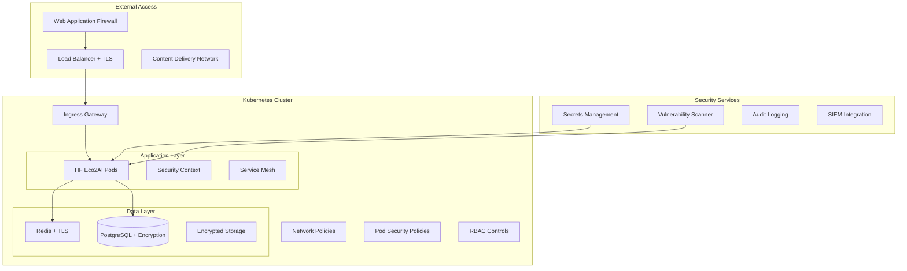

# Security Hardening Guide

## HF Eco2AI Plugin - Enterprise Security Configuration

This comprehensive guide covers security hardening, compliance, and operational security for production deployment of the HF Eco2AI Plugin.

## Table of Contents

1. [Security Overview](#security-overview)
2. [Container Security](#container-security)
3. [Kubernetes Security](#kubernetes-security)
4. [Network Security](#network-security)
5. [Data Protection](#data-protection)
6. [Authentication & Authorization](#authentication--authorization)
7. [Monitoring & Audit](#monitoring--audit)
8. [Compliance Framework](#compliance-framework)
9. [Security Testing](#security-testing)
10. [Incident Response](#incident-response)

## Security Overview

### Security Architecture



### Security Principles

1. **Defense in Depth**: Multiple layers of security controls
2. **Least Privilege**: Minimal required permissions
3. **Zero Trust**: Never trust, always verify
4. **Encryption Everywhere**: Data in transit and at rest
5. **Continuous Monitoring**: Real-time security monitoring
6. **Compliance by Design**: Built-in regulatory compliance

## Container Security

### Secure Container Images

#### Multi-Stage Build Security

```dockerfile
# Security-hardened Dockerfile
FROM python:3.11-slim as builder

# Security updates first
RUN apt-get update && apt-get upgrade -y && \
    apt-get install -y --no-install-recommends \
    build-essential \
    curl \
    && rm -rf /var/lib/apt/lists/* \
    && apt-get clean

# Create non-root user
RUN groupadd --gid 1001 app && \
    useradd --uid 1001 --gid app --create-home --shell /bin/bash app

# Production stage with minimal attack surface
FROM python:3.11-slim as production

# Security updates
RUN apt-get update && apt-get upgrade -y && \
    apt-get install -y --no-install-recommends \
    ca-certificates \
    curl \
    dumb-init \
    tini \
    && rm -rf /var/lib/apt/lists/* \
    && apt-get clean

# Create non-root user
RUN groupadd --gid 1001 app && \
    useradd --uid 1001 --gid app --create-home --shell /bin/bash app

# Security context
USER app
WORKDIR /app

# Remove setuid/setgid bits
RUN find /usr -perm /6000 -type f -exec chmod a-s {} \; || true

# Health check
HEALTHCHECK --interval=30s --timeout=10s --start-period=30s --retries=3 \
    CMD curl -f http://localhost:8000/health || exit 1

# Secure entrypoint
ENTRYPOINT ["tini", "--", "./entrypoint.sh"]
```

#### Container Security Scanning

```yaml
# .github/workflows/security-scan.yml
name: Container Security Scan

on:
  push:
    branches: [main]
  pull_request:
    branches: [main]

jobs:
  container-scan:
    runs-on: ubuntu-latest
    steps:
      - uses: actions/checkout@v4
      
      - name: Build image
        run: docker build -t hf-eco2ai:security-test .
      
      - name: Run Trivy vulnerability scanner
        uses: aquasecurity/trivy-action@master
        with:
          image-ref: 'hf-eco2ai:security-test'
          format: 'sarif'
          output: 'trivy-results.sarif'
          exit-code: '1'
          severity: 'CRITICAL,HIGH'
      
      - name: Run Snyk container scan
        uses: snyk/actions/docker@master
        with:
          image: hf-eco2ai:security-test
          args: --severity-threshold=high
        env:
          SNYK_TOKEN: ${{ secrets.SNYK_TOKEN }}
      
      - name: Upload security results
        uses: github/codeql-action/upload-sarif@v3
        with:
          sarif_file: 'trivy-results.sarif'
```

### Runtime Security

#### Container Runtime Security Context

```yaml
apiVersion: v1
kind: Pod
metadata:
  name: hf-eco2ai
spec:
  securityContext:
    runAsNonRoot: true
    runAsUser: 1001
    runAsGroup: 1001
    fsGroup: 1001
    seccompProfile:
      type: RuntimeDefault
    supplementalGroups: [1001]
  containers:
  - name: hf-eco2ai
    image: hf-eco2ai:1.0.0
    securityContext:
      allowPrivilegeEscalation: false
      readOnlyRootFilesystem: true
      runAsNonRoot: true
      runAsUser: 1001
      runAsGroup: 1001
      capabilities:
        drop:
        - ALL
        add:
        - NET_BIND_SERVICE
      seccompProfile:
        type: RuntimeDefault
    volumeMounts:
    - name: tmp
      mountPath: /tmp
    - name: var-tmp
      mountPath: /var/tmp
  volumes:
  - name: tmp
    emptyDir: {}
  - name: var-tmp
    emptyDir: {}
```

## Kubernetes Security

### Pod Security Standards

#### Pod Security Policy (PSP) - Legacy

```yaml
apiVersion: policy/v1beta1
kind: PodSecurityPolicy
metadata:
  name: hf-eco2ai-psp
spec:
  privileged: false
  allowPrivilegeEscalation: false
  requiredDropCapabilities:
    - ALL
  allowedCapabilities:
    - NET_BIND_SERVICE
  volumes:
    - 'configMap'
    - 'emptyDir'
    - 'projected'
    - 'secret'
    - 'downwardAPI'
    - 'persistentVolumeClaim'
  runAsUser:
    rule: 'MustRunAsNonRoot'
  runAsGroup:
    rule: 'MustRunAs'
    ranges:
      - min: 1001
        max: 1001
  seLinux:
    rule: 'RunAsAny'
  fsGroup:
    rule: 'RunAsAny'
```

#### Pod Security Standards (PSS) - Current

```yaml
apiVersion: v1
kind: Namespace
metadata:
  name: hf-eco2ai-production
  labels:
    pod-security.kubernetes.io/enforce: restricted
    pod-security.kubernetes.io/audit: restricted
    pod-security.kubernetes.io/warn: restricted
    pod-security.kubernetes.io/enforce-version: v1.28
```

### RBAC Configuration

#### Service Account and RBAC

```yaml
apiVersion: v1
kind: ServiceAccount
metadata:
  name: hf-eco2ai
  namespace: hf-eco2ai-production
automountServiceAccountToken: false

---
apiVersion: rbac.authorization.k8s.io/v1
kind: Role
metadata:
  namespace: hf-eco2ai-production
  name: hf-eco2ai-role
rules:
- apiGroups: [""]
  resources: ["pods"]
  verbs: ["get", "list", "watch"]
- apiGroups: [""]
  resources: ["configmaps"]
  verbs: ["get", "list", "watch"]
- apiGroups: [""]
  resources: ["secrets"]
  verbs: ["get"]
  resourceNames: ["hf-eco2ai-secrets"]

---
apiVersion: rbac.authorization.k8s.io/v1
kind: RoleBinding
metadata:
  name: hf-eco2ai-rolebinding
  namespace: hf-eco2ai-production
subjects:
- kind: ServiceAccount
  name: hf-eco2ai
  namespace: hf-eco2ai-production
roleRef:
  kind: Role
  name: hf-eco2ai-role
  apiGroup: rbac.authorization.k8s.io
```

### Network Security

#### Network Policies

```yaml
apiVersion: networking.k8s.io/v1
kind: NetworkPolicy
metadata:
  name: hf-eco2ai-network-policy
  namespace: hf-eco2ai-production
spec:
  podSelector:
    matchLabels:
      app.kubernetes.io/name: hf-eco2ai
  policyTypes:
  - Ingress
  - Egress
  
  ingress:
  # Allow ingress from ingress controller
  - from:
    - namespaceSelector:
        matchLabels:
          name: ingress-nginx
    ports:
    - protocol: TCP
      port: 8000
  
  # Allow ingress from monitoring
  - from:
    - namespaceSelector:
        matchLabels:
          name: monitoring
    ports:
    - protocol: TCP
      port: 9091
  
  egress:
  # Allow DNS resolution
  - to: []
    ports:
    - protocol: UDP
      port: 53
    - protocol: TCP
      port: 53
  
  # Allow HTTPS to external APIs
  - to: []
    ports:
    - protocol: TCP
      port: 443
  
  # Allow database access
  - to:
    - podSelector:
        matchLabels:
          app.kubernetes.io/name: postgresql
    ports:
    - protocol: TCP
      port: 5432
  
  # Allow Redis access
  - to:
    - podSelector:
        matchLabels:
          app.kubernetes.io/name: redis
    ports:
    - protocol: TCP
      port: 6379

---
# Deny all traffic by default
apiVersion: networking.k8s.io/v1
kind: NetworkPolicy
metadata:
  name: default-deny-all
  namespace: hf-eco2ai-production
spec:
  podSelector: {}
  policyTypes:
  - Ingress
  - Egress
```

#### Service Mesh Security (Istio)

```yaml
apiVersion: security.istio.io/v1beta1
kind: PeerAuthentication
metadata:
  name: default
  namespace: hf-eco2ai-production
spec:
  mtls:
    mode: STRICT

---
apiVersion: security.istio.io/v1beta1
kind: AuthorizationPolicy
metadata:
  name: hf-eco2ai-authz
  namespace: hf-eco2ai-production
spec:
  selector:
    matchLabels:
      app: hf-eco2ai
  rules:
  - from:
    - source:
        namespaces: ["ingress-nginx"]
  - to:
    - operation:
        methods: ["GET", "POST"]
        paths: ["/api/*", "/health", "/metrics"]
```

## Data Protection

### Encryption at Rest

#### Kubernetes Secrets Encryption

```yaml
apiVersion: apiserver.config.k8s.io/v1
kind: EncryptionConfiguration
resources:
- resources:
  - secrets
  providers:
  - aescbc:
      keys:
      - name: key1
        secret: <base64-encoded-secret>
  - identity: {}
```

#### Database Encryption

```yaml
# PostgreSQL with TLS
apiVersion: postgresql.cnpg.io/v1
kind: Cluster
metadata:
  name: postgres-cluster
spec:
  instances: 3
  
  postgresql:
    parameters:
      ssl: "on"
      ssl_cert_file: "/var/lib/postgresql/tls/tls.crt"
      ssl_key_file: "/var/lib/postgresql/tls/tls.key"
      ssl_ca_file: "/var/lib/postgresql/tls/ca.crt"
      
  certificates:
    serverTLSSecret: postgres-server-cert
    serverCASecret: postgres-ca-cert
    clientCASecret: postgres-ca-cert
    replicationTLSSecret: postgres-replication-cert
```

### Encryption in Transit

#### TLS Configuration

```yaml
apiVersion: networking.k8s.io/v1
kind: Ingress
metadata:
  name: hf-eco2ai-ingress
  annotations:
    nginx.ingress.kubernetes.io/ssl-redirect: "true"
    nginx.ingress.kubernetes.io/force-ssl-redirect: "true"
    nginx.ingress.kubernetes.io/ssl-protocols: "TLSv1.2 TLSv1.3"
    nginx.ingress.kubernetes.io/ssl-ciphers: "ECDHE-ECDSA-AES128-GCM-SHA256,ECDHE-RSA-AES128-GCM-SHA256,ECDHE-ECDSA-AES256-GCM-SHA384,ECDHE-RSA-AES256-GCM-SHA384"
    cert-manager.io/cluster-issuer: letsencrypt-prod
spec:
  tls:
  - hosts:
    - hf-eco2ai.company.com
    secretName: hf-eco2ai-tls
  rules:
  - host: hf-eco2ai.company.com
    http:
      paths:
      - path: /
        pathType: Prefix
        backend:
          service:
            name: hf-eco2ai
            port:
              number: 80
```

### Secrets Management

#### HashiCorp Vault Integration

```yaml
apiVersion: secrets-store.csi.x-k8s.io/v1
kind: SecretProviderClass
metadata:
  name: hf-eco2ai-vault-secrets
spec:
  provider: vault
  parameters:
    vaultAddress: "https://vault.company.com"
    roleName: "hf-eco2ai"
    objects: |
      - objectName: "database-password"
        secretPath: "secret/data/hf-eco2ai/database"
        secretKey: "password"
      - objectName: "redis-password"
        secretPath: "secret/data/hf-eco2ai/redis"
        secretKey: "password"
      - objectName: "api-key"
        secretPath: "secret/data/hf-eco2ai/api"
        secretKey: "key"

---
apiVersion: apps/v1
kind: Deployment
metadata:
  name: hf-eco2ai
spec:
  template:
    spec:
      serviceAccountName: hf-eco2ai
      volumes:
      - name: secrets-store
        csi:
          driver: secrets-store.csi.k8s.io
          readOnly: true
          volumeAttributes:
            secretProviderClass: "hf-eco2ai-vault-secrets"
      containers:
      - name: hf-eco2ai
        volumeMounts:
        - name: secrets-store
          mountPath: "/mnt/secrets-store"
          readOnly: true
        env:
        - name: DATABASE_PASSWORD
          valueFrom:
            secretKeyRef:
              name: hf-eco2ai-vault-secrets
              key: database-password
```

## Authentication & Authorization

### OAuth 2.0 / OIDC Integration

#### Application Configuration

```yaml
apiVersion: v1
kind: ConfigMap
metadata:
  name: hf-eco2ai-auth-config
data:
  auth.yaml: |
    authentication:
      type: oidc
      oidc:
        issuer_url: https://auth.company.com
        client_id: hf-eco2ai
        client_secret_ref:
          name: oidc-client-secret
          key: client_secret
        scopes:
          - openid
          - email
          - profile
        redirect_uri: https://hf-eco2ai.company.com/auth/callback
        
    authorization:
      type: rbac
      rbac:
        roles:
          admin:
            permissions:
              - carbon_tracking:*
              - monitoring:*
              - configuration:*
          user:
            permissions:
              - carbon_tracking:read
              - monitoring:read
          viewer:
            permissions:
              - carbon_tracking:read
```

### API Security

#### Rate Limiting

```yaml
apiVersion: networking.istio.io/v1beta1
kind: EnvoyFilter
metadata:
  name: rate-limit-filter
spec:
  configPatches:
  - applyTo: HTTP_FILTER
    match:
      context: SIDECAR_INBOUND
      listener:
        filterChain:
          filter:
            name: envoy.filters.network.http_connection_manager
    patch:
      operation: INSERT_BEFORE
      value:
        name: envoy.filters.http.local_ratelimit
        typed_config:
          "@type": type.googleapis.com/udpa.type.v1.TypedStruct
          type_url: type.googleapis.com/envoy.extensions.filters.http.local_ratelimit.v3.LocalRateLimit
          value:
            stat_prefix: rate_limiter
            token_bucket:
              max_tokens: 100
              tokens_per_fill: 10
              fill_interval: 60s
            filter_enabled:
              runtime_key: rate_limit_enabled
              default_value:
                numerator: 100
                denominator: HUNDRED
            filter_enforced:
              runtime_key: rate_limit_enforced
              default_value:
                numerator: 100
                denominator: HUNDRED
```

#### Input Validation

```python
# Security middleware
from fastapi import FastAPI, HTTPException
from fastapi.middleware.cors import CORSMiddleware
from fastapi.middleware.trustedhost import TrustedHostMiddleware
from starlette.middleware.authentication import AuthenticationMiddleware

app = FastAPI()

# Security headers
@app.middleware("http")
async def add_security_headers(request, call_next):
    response = await call_next(request)
    response.headers["X-Content-Type-Options"] = "nosniff"
    response.headers["X-Frame-Options"] = "DENY"
    response.headers["X-XSS-Protection"] = "1; mode=block"
    response.headers["Strict-Transport-Security"] = "max-age=31536000; includeSubDomains"
    response.headers["Content-Security-Policy"] = "default-src 'self'"
    return response

# CORS configuration
app.add_middleware(
    CORSMiddleware,
    allow_origins=["https://hf-eco2ai.company.com"],
    allow_credentials=True,
    allow_methods=["GET", "POST"],
    allow_headers=["*"],
)

# Trusted hosts
app.add_middleware(
    TrustedHostMiddleware,
    allowed_hosts=["hf-eco2ai.company.com", "*.company.com"]
)
```

## Monitoring & Audit

### Security Event Monitoring

#### Falco Rules

```yaml
# /etc/falco/falco_rules.local.yaml
- rule: Unexpected Network Connection
  desc: Detect unexpected network connections from HF Eco2AI pods
  condition: >
    (inbound_outbound) and
    (fd.typechar = 4 or fd.typechar = 6) and
    (container.image.repository contains "hf-eco2ai") and
    not (
      (fd.ip = "10.0.0.0/8") or
      (fd.ip = "172.16.0.0/12") or
      (fd.ip = "192.168.0.0/16") or
      (fd.port in (53, 80, 443, 5432, 6379))
    )
  output: >
    Unexpected network connection from HF Eco2AI
    (user=%user.name container=%container.name image=%container.image.repository
    connection=%fd.name)
  priority: WARNING

- rule: Privileged Container Spawned
  desc: Detect privileged containers in HF Eco2AI namespace
  condition: >
    spawned_process and
    container and
    container.privileged=true and
    k8s.ns.name="hf-eco2ai-production"
  output: >
    Privileged container spawned in HF Eco2AI namespace
    (user=%user.name container=%container.name image=%container.image.repository)
  priority: CRITICAL
```

#### Audit Logging

```yaml
# Kubernetes audit policy
apiVersion: audit.k8s.io/v1
kind: Policy
rules:
# Log all requests to HF Eco2AI resources
- level: RequestResponse
  namespaces: ["hf-eco2ai-production"]
  resources:
  - group: ""
    resources: ["pods", "services", "secrets", "configmaps"]
  - group: "apps"
    resources: ["deployments", "replicasets"]

# Log authentication events
- level: Request
  users: ["system:anonymous"]
  
# Log privilege escalation attempts
- level: Request
  verbs: ["create", "update", "patch"]
  resources:
  - group: ""
    resources: ["pods/exec", "pods/portforward"]
```

### SIEM Integration

#### Security Event Forwarding

```yaml
apiVersion: logging.coreos.com/v1
kind: ClusterLogForwarder
metadata:
  name: security-events
spec:
  outputs:
  - name: splunk-security
    type: splunk
    url: https://splunk.company.com:8088
    secret:
      name: splunk-secret
    splunk:
      index: kubernetes-security
      
  pipelines:
  - name: security-pipeline
    inputRefs:
    - audit
    - infrastructure
    filterRefs:
    - security-filter
    outputRefs:
    - splunk-security
```

## Compliance Framework

### SOC 2 Type II Compliance

#### Control Implementation

```yaml
# Control: Access Controls
apiVersion: v1
kind: ConfigMap
metadata:
  name: soc2-controls
data:
  access-control.yaml: |
    controls:
      CC6.1:
        description: "Logical and physical access controls"
        implementation:
          - RBAC policies implemented
          - Multi-factor authentication required
          - Regular access reviews conducted
        evidence:
          - rbac-policies.yaml
          - mfa-configuration.json
          - access-review-reports/
      
      CC6.2:
        description: "Authentication and authorization"
        implementation:
          - OIDC integration
          - Service account restrictions
          - API key rotation
        evidence:
          - oidc-config.yaml
          - service-account-audit.json
          - api-key-rotation-log.json
```

### GDPR Compliance

#### Data Protection Configuration

```yaml
apiVersion: v1
kind: ConfigMap
metadata:
  name: gdpr-config
data:
  data-protection.yaml: |
    gdpr:
      data_retention:
        user_data: 2555  # 7 years in days
        logs: 90
        metrics: 365
        
      encryption:
        at_rest: AES-256
        in_transit: TLS 1.3
        
      data_minimization:
        collect_only_necessary: true
        anonymization_enabled: true
        
      user_rights:
        access: enabled
        rectification: enabled
        erasure: enabled
        portability: enabled
        
      lawful_basis:
        - legitimate_interest
        - consent
```

### NIST Cybersecurity Framework

#### Framework Mapping

```yaml
# NIST CSF Implementation
nist_csf:
  identify:
    - asset_inventory: kubernetes-resources.yaml
    - risk_assessment: security-risk-assessment.pdf
    - governance: security-policies.md
    
  protect:
    - access_control: rbac-policies.yaml
    - awareness_training: security-training-plan.md
    - data_security: encryption-config.yaml
    
  detect:
    - continuous_monitoring: monitoring-setup.yaml
    - detection_processes: security-monitoring.yaml
    
  respond:
    - response_planning: incident-response-plan.md
    - communications: notification-procedures.md
    
  recover:
    - recovery_planning: disaster-recovery-plan.md
    - improvements: lessons-learned-process.md
```

## Security Testing

### Vulnerability Assessment

#### Automated Security Testing

```yaml
name: Security Testing Pipeline

on:
  schedule:
    - cron: '0 2 * * *'  # Daily at 2 AM
  push:
    branches: [main]

jobs:
  vulnerability-scan:
    runs-on: ubuntu-latest
    steps:
      - uses: actions/checkout@v4
      
      - name: Static Code Analysis
        uses: github/super-linter@v4
        env:
          VALIDATE_KUBERNETES_KUBEVAL: true
          VALIDATE_DOCKERFILE_HADOLINT: true
          
      - name: Dependency Vulnerability Scan
        uses: aquasecurity/trivy-action@master
        with:
          scan-type: 'fs'
          scan-ref: '.'
          format: 'sarif'
          output: 'dependency-results.sarif'
          
      - name: Infrastructure Scan
        uses: aquasecurity/tfsec-action@v1.0.3
        with:
          working_directory: deployment/terraform
          
      - name: Kubernetes Security Scan
        uses: azure/k8s-lint@v1
        with:
          manifests: |
            deployment/kubernetes/*.yaml
            deployment/helm/hf-eco2ai/templates/*.yaml
```

### Penetration Testing

#### Web Application Security Testing

```bash
#!/bin/bash
# penetration-test.sh

# OWASP ZAP Security Testing
docker run -t owasp/zap2docker-stable zap-baseline.py \
  -t https://hf-eco2ai-staging.company.com \
  -g gen.conf \
  -r zap-report.html

# Nuclei vulnerability scanner
nuclei -u https://hf-eco2ai-staging.company.com \
  -t nuclei-templates/ \
  -o nuclei-results.json

# SSL/TLS testing
testssl.sh --jsonfile ssl-report.json https://hf-eco2ai-staging.company.com

# API security testing
newman run api-security-tests.postman_collection.json \
  --environment staging.postman_environment.json \
  --reporters json \
  --reporter-json-export api-test-results.json
```

### Compliance Testing

#### CIS Kubernetes Benchmark

```bash
#!/bin/bash
# Run CIS Kubernetes Benchmark
kube-bench run --targets master,node,etcd,policies \
  --json --outputfile cis-benchmark-results.json

# Parse and evaluate results
python3 << EOF
import json

with open('cis-benchmark-results.json', 'r') as f:
    results = json.load(f)

total_checks = 0
passed_checks = 0

for section in results['Controls']:
    for test in section['tests']:
        for result in test['results']:
            total_checks += 1
            if result['status'] == 'PASS':
                passed_checks += 1

compliance_score = (passed_checks / total_checks) * 100
print(f"CIS Kubernetes Benchmark Compliance: {compliance_score:.2f}%")

if compliance_score < 95:
    print("FAIL: Compliance score below required threshold")
    exit(1)
else:
    print("PASS: Compliance requirements met")
EOF
```

## Incident Response

### Security Incident Response Plan

#### Incident Classification

| Severity | Description | Response Time | Escalation |
|----------|-------------|---------------|------------|
| P0 - Critical | Data breach, system compromise | 15 minutes | CISO, CEO |
| P1 - High | Service disruption, privilege escalation | 1 hour | Security Team Lead |
| P2 - Medium | Suspicious activity, failed authentication | 4 hours | Security Analyst |
| P3 - Low | Policy violation, minor vulnerability | 24 hours | System Administrator |

#### Incident Response Playbook

```yaml
# Security Incident Response
incident_response:
  detection:
    automated_alerts:
      - prometheus_alertmanager
      - falco_alerts
      - siem_detection
    manual_reporting:
      - security_hotline
      - incident_portal
      
  triage:
    initial_assessment:
      - impact_evaluation
      - scope_determination
      - severity_classification
    containment:
      - isolate_affected_systems
      - preserve_evidence
      - prevent_lateral_movement
      
  investigation:
    evidence_collection:
      - system_logs
      - network_traffic
      - memory_dumps
    forensic_analysis:
      - timeline_reconstruction
      - root_cause_analysis
      - impact_assessment
      
  remediation:
    immediate_actions:
      - patch_vulnerabilities
      - reset_credentials
      - update_security_controls
    long_term_fixes:
      - architecture_changes
      - process_improvements
      - training_updates
      
  recovery:
    service_restoration:
      - system_verification
      - functionality_testing
      - performance_monitoring
    post_incident:
      - lessons_learned
      - documentation_update
      - improvement_implementation
```

#### Automated Incident Response

```yaml
apiVersion: argoproj.io/v1alpha1
kind: Workflow
metadata:
  name: security-incident-response
spec:
  entrypoint: incident-response
  templates:
  - name: incident-response
    steps:
    - - name: detect
        template: detection
    - - name: triage
        template: triage-assessment
    - - name: contain
        template: containment
        when: "{{steps.triage.outputs.parameters.severity}} == 'critical'"
    - - name: investigate
        template: investigation
    - - name: remediate
        template: remediation
    - - name: recover
        template: recovery
        
  - name: containment
    script:
      image: kubectl:latest
      command: [bash]
      source: |
        # Isolate affected pods
        kubectl label pods -l app=hf-eco2ai quarantine=true
        
        # Apply restrictive network policy
        kubectl apply -f emergency-network-policy.yaml
        
        # Scale down affected deployment
        kubectl scale deployment hf-eco2ai --replicas=0
        
        # Notify security team
        curl -X POST $SLACK_WEBHOOK_URL \
          -H 'Content-type: application/json' \
          --data '{"text":"Security incident containment activated"}'
```

### Security Metrics and KPIs

#### Security Dashboard

```yaml
security_metrics:
  vulnerability_management:
    - critical_vulnerabilities: 0
    - high_vulnerabilities: < 5
    - mean_time_to_patch: < 24h
    - vulnerability_scan_frequency: daily
    
  access_control:
    - failed_authentication_rate: < 1%
    - privileged_access_reviews: monthly
    - unused_accounts: 0
    - mfa_adoption_rate: 100%
    
  incident_response:
    - mean_time_to_detection: < 15min
    - mean_time_to_containment: < 1h
    - mean_time_to_resolution: < 4h
    - security_incidents_per_month: < 2
    
  compliance:
    - security_control_effectiveness: > 95%
    - audit_findings: 0 critical
    - policy_compliance_rate: > 98%
    - security_training_completion: 100%
```

### Security Automation

#### Security Orchestration

```python
# Security automation framework
import asyncio
from kubernetes import client, config
from prometheus_api_client import PrometheusConnect

class SecurityOrchestrator:
    def __init__(self):
        config.load_incluster_config()
        self.k8s_client = client.AppsV1Api()
        self.prometheus = PrometheusConnect(url="http://prometheus:9090")
    
    async def monitor_security_events(self):
        """Continuous security monitoring"""
        while True:
            # Check for security alerts
            alerts = self.prometheus.get_current_metric_value(
                metric_name='ALERTS{alertname=~".*Security.*"}'
            )
            
            for alert in alerts:
                await self.handle_security_alert(alert)
            
            await asyncio.sleep(30)
    
    async def handle_security_alert(self, alert):
        """Handle security alert"""
        severity = alert['metric']['severity']
        alertname = alert['metric']['alertname']
        
        if severity == 'critical':
            await self.emergency_response(alert)
        elif severity == 'warning':
            await self.standard_response(alert)
    
    async def emergency_response(self, alert):
        """Emergency security response"""
        # Isolate affected resources
        await self.isolate_workload(alert['metric']['pod'])
        
        # Notify security team
        await self.send_alert_notification(alert, urgency='high')
        
        # Collect forensic data
        await self.collect_forensic_evidence(alert)
    
    async def isolate_workload(self, pod_name):
        """Isolate affected workload"""
        # Apply quarantine label
        self.k8s_client.patch_namespaced_deployment(
            name='hf-eco2ai',
            namespace='hf-eco2ai-production',
            body={'metadata': {'labels': {'quarantine': 'true'}}}
        )
```

---

This comprehensive security hardening guide provides enterprise-grade security controls, compliance frameworks, and operational procedures for the HF Eco2AI Plugin. Regular review and updates of these security measures are essential to maintain a strong security posture against evolving threats.

**Security Contacts:**
- 🚨 Security Incident Hotline: +1-800-SECURITY
- 📧 Security Team: security@company.com
- 🔒 CISO Office: ciso@company.com
- 📚 Security Portal: https://security.company.com